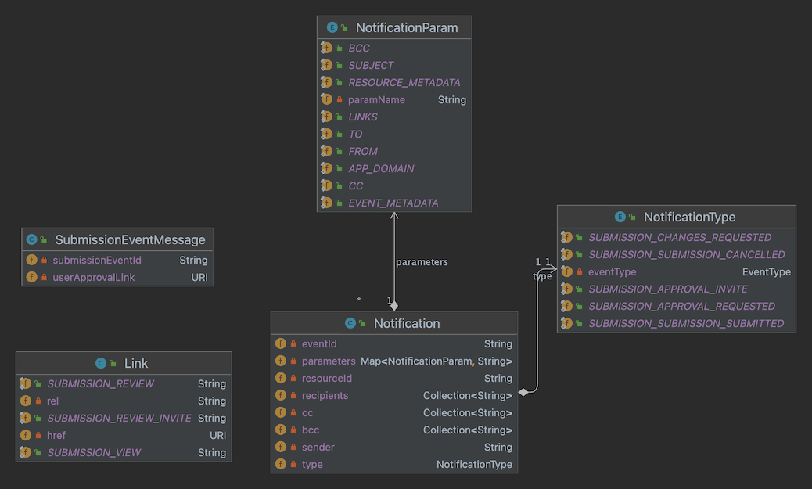
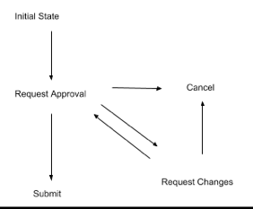

# Notification Services - Model

<figure>
  
  <figcaption>
    
PASS Notification Model

  </figcaption>
</figure>

The `Notification` class is the central object in the model. It is used to capture the type of notification for a given 
submission and to provide the data to the notification template.

Let's review the important attributes of `Notification`:

`Notification.resouceId`: The PASS entity ID for the `Notification`.

`Notification.eventId`: The SubmissionEvent ID for the `Notification`.

The SubmissionEvent is the object that captures the submission workflow event, which generates the `Notification`. The 
table below describes a submission workflow action, the submission event type created, and who receives the notification.

<figure>
  
  <figcaption>
    
Submission State

  </figcaption>
</figure>

| What happened to the Submission | SubmissionEvent Type                           | Notification Recipient List |
|---------------------------------|------------------------------------------------|-----------------------------|
| AS Cancelled                    | CANCELLED                                      | Preparer                    |
| AS Submitted                    | SUBMITTED                                      | Preparer                    |
| AS Request Changes              | CHANGES_REQUESTED                              | Preparer                    |
| Preparer Cancelled              | CANCELLED                                      | AS                          |
| Preparer Request Approval       | APPROVAL_REQUESTED, APPROVAL_REQUESTED_NEWUSER | AS                          |

* AS = Authorized Submitter
* Preparer = Proxy who has prepared the submitter on behalf of the AS

`Notification.type`: The type of the `Notification`. In this case, there is a 1:1 correspondence between the `SubmissionEvent`
type and the `Notification` type.

| Notification Type               | Description                                                                                                  |
|---------------------------------|--------------------------------------------------------------------------------------------------------------|
| SUBMISSION_APPROVAL_REQUESTED   | Preparer has requested approval of a Submission by an Authorized Submitter                                   |
| SUBMISSION_APPROVAL_INVITE      | Preparer has requested approval of a Submission by an Authorized Submitter who does not have a User in PASS. |
| SUBMISSION_CHANGES_REQUESTED    | Authorized Submitter has requested changes to the submission by the Preparer.                                |
| SUBMISSION_SUBMISSION_SUCCESS   | Submission was successfully submitted by the Authorized Submitter                                            |
| SUBMISSION_SUBMISSION_CANCELLED | Submission was cancelled by either the Authorized Submitter or Preparer                                      |

`Notification.parameters`: The model that is injected into the templating engine. The `parameters` map carries simple 
strings or serialized JSON structures.
- `TO`, `CC`, `BCC`, `FROM`, and `SUBJECT` are all simple strings.
- `RESOURCE_METADATA`, `EVENT_METADATA`, and `LINKS` all contain serialized JSON structures.
- Handlebars, the Mustache-based template engine, can navigate the JSON structures to pull out the desired information 
for email templates.

Templates are parameterized by the NS model. This allows for simple variable substitution when rendering the content of 
an email notification. The template language supported by NS is [Mustache](https://mustache.github.io/), specifically
the [Handlebars](https://github.com/jknack/handlebars.java) Java implementation.  For details on Mustache and Handlebars, check out the [Handlebars blog](http://jknack.github.io/handlebars.java/)
and the [Mustache(5) man page](http://mustache.github.io/mustache.5.html).  Sample templates are available in the `templates/` folder of the[`notification-services`](https://github.com/eclipse-pass/pass-docker)
container in [pass-docker](https://github.com/eclipse-pass/pass-docker) or in the `HandlebarsParameterizerTest` class.

The model provided for template parameterization will depend on the version of NS used, because NS composes and 
parameterizes the model at compile time. Initially NS provides the following model to the Handlebars templating engine:
- `to`: a string containing the email address of the recipient of the notification.
- `cc`: a string containing comma delimited email addresses of any carbon copy recipients.
- `from`: a string containing the email address of the sender of the notification.
- `resource_metadata`: a JSON object containing metadata about the `Submission`:
    - `title`: the title of the `Submission`.
    - `journal-title`: the name of the journal that the author accepted manuscript is being published to.
    - `volume`: the volume of the journal that the author accepted manuscript is being published to.
    - `issue`: the issue of the journal that the author accepted manuscript is being published to.
    - `abstract`: the abstract of the `Submission`.
    - `doi`: the DOI assigned by the publisher to the author accepted manuscript.
    - `publisher`: the name of the publisher.
    - `authors`: a JSON array of author objects.
- `event_metadata`: a JSON object containing metadata about the `SubmissionEvent`:
    - `id`: the identifier of the event, a URI to the `SubmissionEvent` resource.
    - `comment`: the comment provided by the preparer or authorized submitter associated with the `SubmissionEvent`.
    - `performedDate`: the DateTime the action precipitating the event was performed.
    - `performedBy`: the URI of the `User` resource responsible for precipitating the event.
    - `performerRole`: the role the `performedBy` user held at the time the event was precipitated.
- `link_metadata`: a JSON array of link objects associated with the `SubmissionEvent`.
    - Each link object has an `href` attribute containing the URL, and a `rel` attribute describing its relationship to
    the `SubmissionEvent`.
    - Supported `rel` values are:
        - `submission-view`: a link to view the `Submission` resource in the Ember User Interface.
        - `submission-review`: a link to review and approve a `Submission` in the Ember User Interface.
        - `submission-review-invite`: a link which invites the recipient of the notification to the Ember User Interface, 
        and subsequently presents the review and approve workflow in the Ember User Interface.