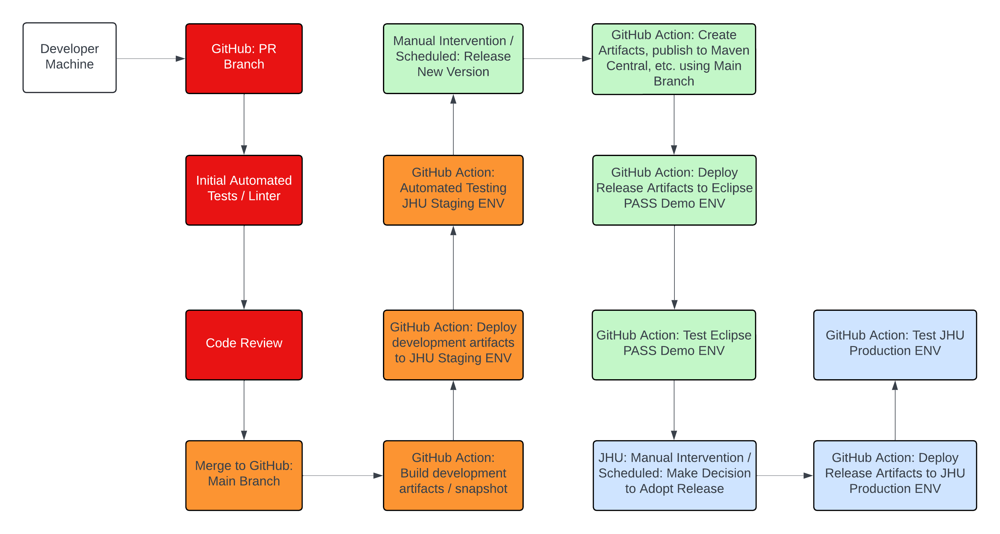

# PASS Continuous Integration and Continuous Delivery

## Defining Concepts:

### CI: Continuous Integration 
Continuous integration is a devops software development practice where developers regularly merge code changes into a central repository, after which automated builds and tests are run.

### CD: Continuous Delivery 
Continuous delivery is a software development practice where code changes are automatically prepared for a release. Continuous delivery deploys all code changes to a testing environment after the build stage. After a successful continuous delivery run developers will have a deployment-ready build artifact that has passed through a standardized test process. 

### CD: Continuous Deployment 
Continuous deployment takes continuous delivery a step further. Continuous Deployment takes the deployment-ready build artifact that passed through the standardized test process and automatically deploys the artifact into a production environment. 

### Continuous Deployment vs Continuous Delivery
The difference between continuous delivery and continuous deployment is the presence of a manual approval to update to production. With continuous deployment, production happens automatically without explicit approval. 

### CI/CD vs. Automation
CI/CD is automating the build, release, and deployment process 
All CI/CD utilizes automation but not all automation is CI/CD 

## Current Status 
The CI/CD pipeline for the PASS project utilizes GitHub Actions in order to automate testing and deployment of some environment assets. Testing reliability has been improved significantly. Currenly GitHub Actions for testing are ran automatically when a pull request is open. Automation for deploying assets is manually triggered during the PASS release process. Currently the pipeline has several areas where manual intervention is required. 
The PASS team is eager to improve the pipeline. The team is working towards improving the CI/CD pipeline to achieve reliable continuous delivery. Once the team is confident in the continuous delivery the team hopes to implement continuous deployment. 

### GitHub Actions 
The PASS project utilizes GitHub Actions in order to build a CI/CD pipeline. The GitHub Actions can be triggered using multiple methods. The trigger methods include: Event Trigger, Manual Trigger, and Scheduled Trigger. An event trigger kick starts a GitHub Action when a certain event occurs, for example when a pull request is opened. A manual trigger kick starts a GitHub Action when someone tells the action to run. A scheduled trigger kick starts a GitHub Action at a scheduled time. 

### Pull Request Submission Trigger 
When a pull request is opened multiple GitHub Actions are triggered automatically. One of the GitHub Actions focuses on continuous integration concepts. The continuous integration GitHub Action runs several forms of tests. The following tests are run: Acceptance Tests, Unit Tests, and Integration Tests. Another GitHub Action is triggered during the opening of a pull request, the Git ECA Validation Status actioon. The Git ECA Validation Status action verifies that the author of the pull request is covered by necessary legal agreements to contribute to an Eclipse Foundation Project. Once the actions have completed the GitHub user interface shows if the tests passed or failed. 

### CI/CD Workflow Proposal
The team is in the process of implementing the following proposal workflow:
<figure><figcaption></figcaption></figure>

## Related Documentation:
* [Release Process](../../developer-documentation/release/README.md)
* [Acceptance Testing](../../developer-documentation/pass-acceptance-testing/README.md)

