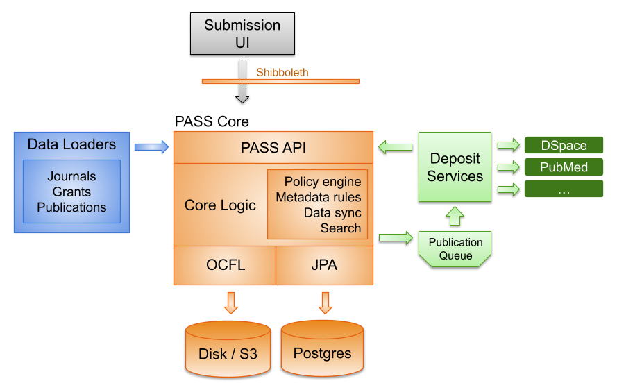

# Operations/Production - PASS Design & AWS Architecture

The PASS design supports flexible and scalable submission workflows of research publications. It consists of four main
components: PASS UI, Data Loaders, PASS Core, and Deposit Services. PASS Core acts as the central backbone, coordinating
the workflow through, Elide, a JSON:API that interfaces with various services. It stores documents using the 
[Oxford Common File Layout (OCFL)](https://ocfl.io/) on disk or through an S3 bucket, while the backend services are 
written in Java using Spring Boot. Data Loaders handle the ingestion of journal, grant, and publication data, while 
Deposit Services manage the deposits of submissions into various repositories like DSpace, NIH, and InvenioRDM.

It is important to note that the AWS architecture described in this article reflects the choices made by JHU on how to 
deploy PASS. The deployment can be done in various ways, including being hosted on other cloud providers or operated on 
infrastructure managed locally by the institution. The different components of PASS and their associated production 
setup and operations that will be discussed in this article are specific to JHU. Some of these items may be needed in 
another PASS deployment, but some may not all depending on the institution's architectural decisions.

The JHU PASS architecture is deployed on AWS, leveraging services such as Elastic Compute Cloud (EC2), Elastic Container 
Service (ECS), Simple Storage Service (S3), and Simple Queue Service (SQS) to ensure high availability, scalability, and
security. This setup allows PASS to efficiently handle submission workflows and deposit services across diverse 
environments, adhering to institutional policies and data governance standards. 

A quick review of the PASS design and application architecture from our [Deployment and Architecture page](../../welcome-guide%2Fdeployment-architecture.md)
in the [PASS Welcome Guide](../../welcome-guide). Both the PASS Design diagram and Application Architecture diagram are below for a 
quick reference:

<figure>
    
    <figcaption>
        
PASS Design Diagram

    </figcaption>
</figure>

<figure>
    
    <figcaption>
        
PASS Application Diagram

    </figcaption>
</figure>

## JHU PASS AWS Resources Details

### Virtual Private Cloud (VPC)

The infrastructure operates across two VPCs. The main VPC, hosts the PASS components and is 
equipped with both public and private subnets, without direct connectivity to the JHU network. The secondary VPC, 
includes a private subnet with connectivity to the JHU network, facilitating secure data access and integration with
resources within the JHU networks, such as the Grant loader and JHU's institutional repository.

### Identity and Access Management (IAM) and Security Groups

AWS IAM and security groups are used to manage the access and security of the PASS application. Following best security
practices IAM Roles have been created with "least privilege" policies and assigned to the resources. Additionally,
Security Groups have been created and assigned to AWS resources to restrict inbound and outbound connections to align
with "least privilege" access.

### EC2 - PASS Core and UI

PASS Core and UI are deployed on an EC2 instance. This instance is part of the main VPC and is configured to run the 
PASS Core API/UI. Configuration files and deployment scripts for PASS Core/UI are stored in S3, allowing for easy 
access and management during deployments and updates. In addition, the AWS Systems Manager parameter store contains 
configuration of environment variables in the PASS application. PASS Core uses SQS for message queuing to handle 
asynchronous communication between different components of the PASS system. For example, when a submission is made, a 
message is placed in an SQS queue, which is then processed by the deposit services. PASS-UI interacts with AWS 
infrastructure by utilizing the EC2 instance for hosting, ALBs for managing traffic, and S3 for storing static assets.

#### SSO - Shibboleth

PASS Core/UI integrates with Shibboleth for authentication, providing a single sign-on experience for users. Shibboleth 
is a single sign-on system that is used at JHU. The interoperability of this depends on the institution and the header
variables in the web browser that are passed by the identity provider. Please contact the PASS team for more information
regarding how to integrate with SSO.

### RDS - PASS Database

PASS Core uses Amazon RDS, specifically a PostgreSQL database, to store and manage data related to publications,
submissions, grants, and policies. The RDS instance resides within the same VPC and is not publicly accessible,
consequently this means devops cannot connect directly to the database using SQL tools; however by using a jumpbox it is
possible to connect via an SSM managed session if needed. The EC2 instances running PASS Core communicate with the RDS
instance over the VPC’s internal network. Security groups are configured to allow traffic between PASS Core and the RDS
database, ensuring secure data access.

### Elastic Container Services (ECS)

#### Deposit Services

Deposit Services are responsible for processing submission data from PASS Core and ensuring it is correctly formatted
and packaged for deposit into external repositories. This involves transforming submission metadata and bundling content
according to repository requirements. It is deployed as containerized applications using ECS Fargate. As described in
the Application Architecture, Deposit Services leverages SQS to handle the asynchronous processing of deposit tasks.
When a submission is ready for deposit, PASS Core places a message in an SQS queue, which Deposit Services then pick up
for processing. The Deposit Service ECS task is configured to be able to access ECR, SSM Parameter store, SQS, and S3.
Deposit services read messages from SQS queues. Deposit Services reads the repository.json configuration file from an
S3 bucket.

#### Notification Services

Notification Services are responsible for consuming messages from the submission event queues and sending notifications 
via email. The Notification Service ECS task is configured to be able to access the ECR, SSM Parameter store, and SQS. 
SES is enabled in production mode for sending emails from the notifications service.

#### Data Loaders

The Data Loaders (Journal, Grant, Publication) are executed as AWS Batch jobs within ECS Fargate compute
environments, each designed to accommodate specific data processing needs. The batch jobs leverage AWS services like S3
for configuration management, EventBridge Scheduler for scheduling batch jobs, and ECS Fargate for
executing the containerized data loaders. The data loaders have the required permissions for accessing resources like S3
buckets and connecting to the PASS Core API.

### Application Load Balancers (ALB)

There are two ALBs, one for handling external traffic and another for internal communication between the different 
components of PASS. The public load balancers handles requests for the domain name. All traffic is forwarded to HTTPS,
and there is a security group that is attached, allowing only inbound/outbound requests to specific ports. The other
load balancer for internal communication has as similar setup but is private meaning it is not accessible outside the 
VPC private network. Similarly, it has an attached security group for permitting specific ports for inbound/outbound 
requests.

#### Target Groups

Target Groups are used by ALBs to forward requests to the EC2 instances running the Pass-core/Pass-UI docker containers. 
There are two target groups, one for the public ALB and one for the private ALB.

### Web Application Firewall (WAF)

A WAF sits at the edge of the architecture boundary, as pictured in the PASS Application Architecture diagram, between
the end users and the PASS ALB. It is responsible for applying a set of rules to filter out traffic and protect the
internal virtual network.

### Certificate Manager

The certificate for the PASS public domain name for JHU is in AWS Certificate Manager.

### Simple Email Service (SES)

SES is enabled in production mode for sending emails from the notifications service.

### Elastic Container Registry (ECR)

ECR is a fully managed Docker container registry that makes it easy for developers to store, manage, and deploy Docker 
container images. It's leveraged in the PASS Application Architecture by giving a private repository to store the
released Docker images for PASS Core, PASS UI, Data Loaders, Deposit Services, and Notification Services.

### SQS Queues

SQS publication queue serves as a decoupling mechanism between the PASS Core and Deposit and Notification Services. 
Submissions are processed asynchronously, resulting in a system that remains responsive and efficient. There are three 
queues that are used by the overall PASS environment: `deposit`, `submission`, and `submission-event`.

### S3

PASS uses S3 for configuration, deployment, and file storage. PASS Core uses Amazon S3 to store submission-related 
documents and metadata. The OCFL is employed to organize these files, providing options for local disk storage or S3 
bucket retention. The configuration of the File Service in PASS Core is done through environment variables that are set 
in the Systems Manager parameter store. Public access is blocked on all S3 buckets.
