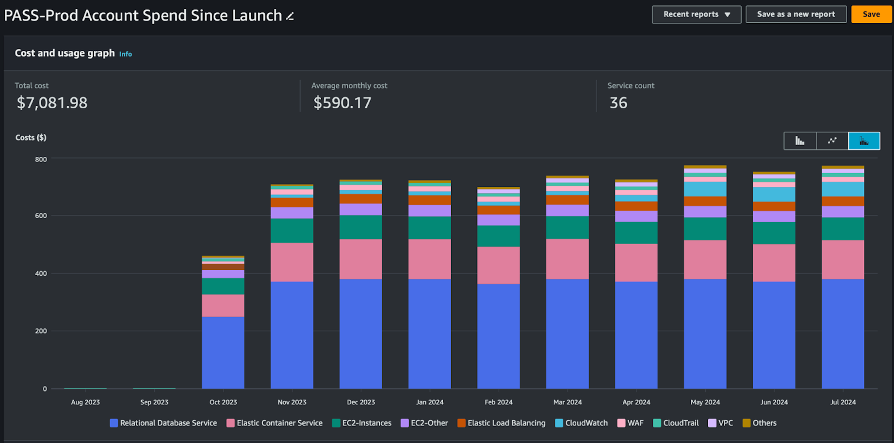

# Operations/Production - AWS Cost Estimates
In making the decision to use AWS for PASS production infrastructure, cost will invariably be a deciding factor. This
article describes the various cost factors and cost estimates sampling of running such an architecture as described in
[PASS Design & AWS Architecture](./ops-aws-arch.md). Costs will of course be variable and dependent on the exact 
implementation.

## AWS Resource Cost Factors
The table below contains the AWS resources used by JHU and the configuration options that will impact the cost for each 
resource most significantly. The order of the resources is based on percentage of the monthly expense, for instance AWS 
RDS is the most expensive resource in our implementation. The JHU Configuration column has details for each resource as
of September 2024 for what our system currently requires for compute, storage, IO, and monitoring. The [AWS Pricing Calculator](https://calculator.aws/#/) 
can be used to estimate cost for a PASS application AWS architecture to your specifications.

### AWS Relational Database Service (RDS)

* **Cost Factors**
    * Database Instance Class
    * Storage Size/IO Bandwidth
    * Snapshot retention
    * Data Transfer
    * Database License
* **JHU Configuration**
    * AWS RDS PostgreSQL
    * Multi-AZ
    * Instance Class: db.m5.large
    * Storage: SSD (gp3) 500 GiB
    * Snapshot retention: Daily system snapshot 7 days (Default)
* [Pricing](https://aws.amazon.com/rds/pricing/)

### AWS Elastic Container Service (ECS) Fargate

* **Cost Factors**
    * ECS Task vCPU/Memory allocation
    * Ephemeral Storage > 20GB
* **JHU Configuration**
    * 3 ECS Tasks run for deposit and notification services 24/7
    * Per task 1vCPU/4GBMem
    * 4 ECS tasks run for data loader jobs for 2 hours/day
    * Per task 2vCPU/4GBMem
    * 20GB ephemeral storage for each Task
* [Pricing](https://aws.amazon.com/fargate/pricing/)

### AWS Elastic Compute Cloud (EC2)

* **Cost Factors**
    * EC2 Instance Type
    * Storage Size/IO Bandwidth
    * Data Transfer
* **JHU Configuration**
    * 1 EC2 for Pass-core/Pass-UI, Instance Type: m5.large, Storage: EBS 40GiB
    * 1 EC2 for jumpbox, Instance Type: t3.micro, Storage: EBS 8GiB
* [Pricing](https://aws.amazon.com/ec2/pricing/)

### AWS CloudWatch

* **Cost Factors**
    * Size of Logs
    * Number of Custom Metrics
    * Number of Dashboards
* **JHU Configuration**
    * 7 alarms
    * 3 custom metrics
    * 1 Dashboard
    * 1 Canary Script
* [Pricing](https://aws.amazon.com/cloudwatch/pricing/)

### AWS Load Balancer

* **Cost Factors**
    * Usage rate
    * Data transfer
* **JHU Configuration**
    * 2 ALBs
    * 3 Listeners and Rules
* [Pricing](https://aws.amazon.com/elasticloadbalancing/pricing/)

### AWS Web Application Firewall (WAF)

* **Cost Factors**
    * Number/type of Rules
    * Bot Control
- **JHU Configuration**
    * 3 Rules
    * 1 Bot Control
* [Pricing](https://aws.amazon.com/waf/pricing/)

### AWS Simple Storage Service (S3)

* **Cost Factors**
    * Storage Type
    * Storage Size
* **JHU Configuration**
    * ~ 5 Buckets
    * ~ 3 GB Total as of Sept 2024
* [Pricing](https://aws.amazon.com/s3/pricing/)

## AWS Cost Metrics Sampling
JHU’s PASS production architecture detailed above results in a fairly-consistent operating cost totaling $700-$800 per
month.

<figure>
  
  <figcaption>
    
PASS Account Spend

  </figcaption>
</figure>

* About half of the spend is dedicated to the High Availability (HA) production database.
* Compute resources comprise roughly a quarter of the spend.
* The remainder of the cost is spread across supporting services, such as monitoring logging, and security.
* Storage costs for PASS are currently negligible.

# Sample of Cost Metrics: July, 2024

| Service                    | Costs |
|----------------------------|-------|
| **RDS**                    | $379  |
| **ECS**                    | $134  |
| **EC2**                    | $76   |
| **CloudWatch**             | $50   |
| **EC2-Other**              | $39   |
| **Elastic Load Balancing** | $33   |
| **WAF**                    | $15   |
| **VPC**                    | $14   |
| **CloudTrail**             | $12   |
| **Config**                 | $3.82 |
| **DevOps Guru**            | $3.12 |
| **S3**                     | $1.54 |
| **Lambda**                 | $1.04 |
| **SQS**                    | $0.24 |
| **SSM**                    | $0.19 |
| **ECR**                    | $0.18 |
| **Route 53**               | $0.10 |
| **Key Management Service** | $0.06 |
| **Total costs**            | $772  |
