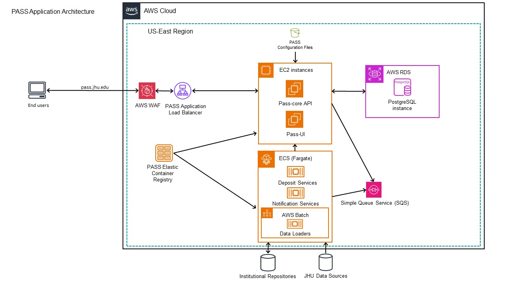
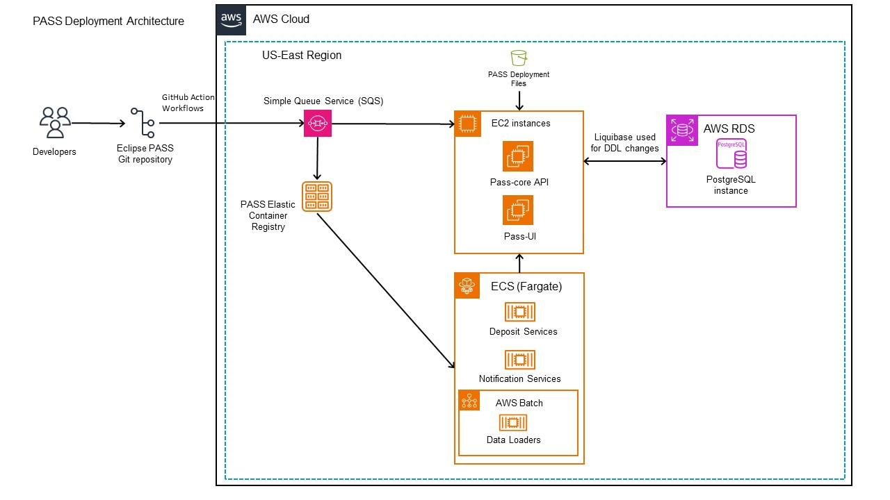

# PASS Architecture

PASS is designed to run on a variety of different platforms and architectures capable of  running Spring Boot applications. This article describes one deployment strategy by highlighting the own Johns Hopkins University's application and deployment architecture. To achieve this deployment, several techniques are utilized including Continuous Integration and Continuous Deployment as known as CI/CD.&#x20;

## PASS Application Architecture

The PASS system's Amazon Web Services (AWS) application architecture employs a variety of AWS services to ensure high availability, security, and scalability. Two main components of the application architecture are the Elastic Cloud Compute (EC2) instances, which host the main application and the Elastic Container Service (ECS) containers, which are composed of the supporting Deposit services, Notification Services and Data Loaders. The diagram below provides a visual representation of  JHU's deployment architecture:

<figure>
    
    <figcaption>
        
JHU's Application Architecture

    </figcaption>
</figure>

The main PASS application utilizes Elastic Compute Cloud (EC2) instances for Pass-core API and the Pass-UI. An Application Load Balancer (ALB) sits between these instances and Web Application Firewall (WAF), which gives security and stability to the PASS application. The ALB distributes incoming requests to appropriate target groups, which in turn route traffic to the correct EC2 instances running Pass-core and Pass-UI. The configuration of the Docker images running in EC2 comes from an S3 bucket which stores the configuration files. Persistence of the PASS application data is achieved by AWS Relational Database Service, and in particular using a PostgreSQL instance. All Docker images for the EC2 instances are stored in the Elastic Container Registry (ECR). The PASS application submits messages to the Simple Queue Service (SQS) when a submission is made. The Deposit Services listens for this and consumes those messages. This configuration, with the EC2 instances support a scalable and flexible environment when new application features are implemented and when user demand grows.

Supporting the application infrastructure, AWS ECS Fargate hosts containerized services, namely the Deposit and Notification Services, which handle background processing and user interaction through scheduled tasks and real-time event responses. The AWS Batch service running on ECS, with dedicated computational environments for batch jobs, allows for efficient management of tasks such as data transfer from institutional repositories and JHU data sources. As mentioned earlier, the Deposit Services listens to the SQS and consumes the messages in the event of a submission and makes the appropriate deposit to the relevant institutional repository. This comprehensive setup ensures that the PASS system remains responsive and capable of scaling according to demand, while also adhering to organizational policies and data governance standards.

## PASS Deployment Architecture

The deployment workflow starts when developers contribute code to the Eclipse PASS Git repository. Changes in this repository trigger GitHub Actions workflows, which are part of an automated CI/CD pipeline facilitating the deployment of the updated code. In deployment SQS is utilized for initiating the deployment from a GitHub workflow that publishes a SNS topic to the queue. The PASS deployment files contain configurations and environment variables that assist in the deployment of the PASS application and supporting services. Liquibase is utilized to manage database schema changes, which interacts with an AWS RDS instance running PostgreSQL.&#x20;

<figure>
    
    <figcaption>
        
JHU's Deployment Architecture

    </figcaption>
</figure>

For other organizations looking to adopt a similar AWS application and deployment model, it's important to recognize that while the core architecture offers a template, it should be adapted to meet an organization's own requirements and needs. Each organization will need to evaluate its own application demands, data sensitivity, and user base to tailor the cloud resources, network configurations, and security policies accordingly. Moreover, integrating other types of cloud infrastructure or even on-premise solutions might be necessary to address specific technological preferences or regulatory requirements. Hybrid cloud environments or multi-cloud strategies could be employed to leverage the strengths of various cloud providers, enhance resilience, and avoid vendor lock-in. PASS is designed to be flexible and can adapt to a variety of architectures; whether a cloud infrastructure, hybrid or on-premise.
